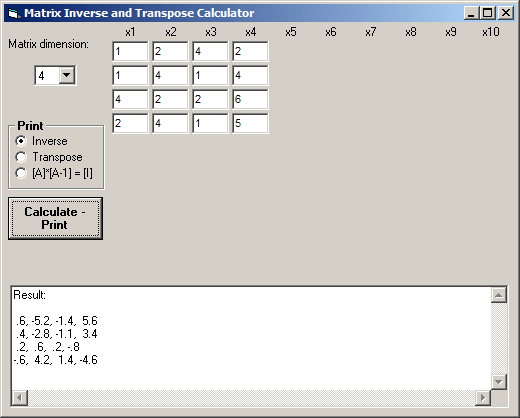



## Matrix Inverse and Transpose Calculator \(v1\.1\)

### Description

This is a program that calculates the Inverse of a Rectangular Matrix [A] (Dimensions N x N) using the Gauss elimination method, the product [A]*[A-1] for verification purposes (must be always equal to Singular Matrix [I]) and also the transpose of Matrix [A]. The interface is limited to 10x10 dimensions, but the solver itself can

be used to calculate the Inverse of any Rectangular Matrix, provided the determinant of it is non-zero. v1.1 fixes a bug of the first version.
 
### More Info
 

             |
---                |---
**Submitted On**   |2004-02-10 13:28:44
**By**             |[Vagelis Plevris](https://github.com/Planet-Source-Code/PSCIndex/blob/master/ByAuthor/vagelis-plevris.md)
**Level**          |Advanced
**User Rating**    |5.0 (10 globes from 2 users)
**Compatibility**  |VB 4\.0 \(32\-bit\), VB 5\.0, VB 6\.0
**Category**       |[Math/ Dates](https://github.com/Planet-Source-Code/PSCIndex/blob/master/ByCategory/math-dates__1-37.md)
**World**          |[Visual Basic](https://github.com/Planet-Source-Code/PSCIndex/blob/master/ByWorld/visual-basic.md)
**Archive File**   |[Matrix\_Inv1706952102004\.zip](https://github.com/Planet-Source-Code/vagelis-plevris-matrix-inverse-and-transpose-calculator-v1-1__1-50592/archive/master.zip)

